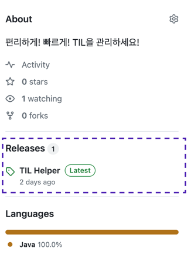

# 사용 전 확인 사항
- Java가 설치되어 있어야합니다.
- **파일명**과 **폴더명**에 공백을 넣으면 안됩니다. 공백은 '-'로 표현해주세요. ex)영희와 철수(x) 영희와-철수(o)
- **파일명**과 **폴더명**에는 한글, 영문, '-' 만 사용해 주세요.
# 사용 방법
처음 사용하는 상황을 가정합니다. 매우 간단하니 원할한 사용을 위해 읽어주세요.
1. 오른쪽 사이드에 Releases에 있는 TIL Hepler에 클릭 후 들어가서, TIL-HELPER.jar파일을 다운로드 받아주세요. 

2. 본인(로컬) 컴퓨터에 TIL 기록할 폴더를 생성합니다.
3. 생성한 폴더를 깃허브와 연동 시킵니다. 로컬 Git폴더가 github와 연동되어 있어야지 자동으로 github에 업로그되는 기능을 사용할 수 있습니다. github와 연결해주세요.
4. TIL-HELPER.jar을 깃 저장소 루트에 위치 시킵니다. 
```
.
├── TIL-HEPLER.jar ⭐️⭐️⭐️ 이곳에 두기 ⭐️⭐️⭐️
├── category01/
│   ├── til-01.md
│   └── til-02.md
├── category02/
│   ├── til-03.md
│   ├── til-04.md
│   └── til-05.md
└── ...
```
**중요!!**

TIL 제목은 작성된 markdown파일 맨 처음에 원하는 제목(이건 제한사항 없어요)입력하고 엔터한번 해주시면 됩니다.

**예시**
```markdown
TIL의 제목!!! 마크다운 문서 맨 첫줄에 제목 기입하시면 이게 README.md에 제목으로 기입됩니다.

## 여기서 부터 작성하시면 됩니다.
참 쉽다
## 오늘 배운것
~~~
```
4. jar파일을 실행합니다
   - 실행방법 : TIL-HELPER.jar이 있는 위치에서 터미널이나 윈도우쉘에 `java -jar TIL-HELPER.jar`을 입력하면 됩니다.
5. 깃 저장소 루트 폴더를 찾아보면 README.md 가 생성된걸 확인 할 수 있습니다.
# 다시한번 주의!!!
- Java가 설치되어 있어야합니다.
- **파일명**과 **폴더명**에 공백을 넣으면 안됩니다. 공백은 '-'로 표현해주세요. ex)영희와 철수(x) 영희와-철수(o)
- **파일명**과 **폴더명**에는 한글, 영문, '-' 만 사용해 주세요.
# TIP
- (mac os)shell script를 통해서 터미널 열때마다 java -jar TIL-HELPER.jar을 직접 입력하지 말고 더블클릭 한번으로 실행이 가능합니다.
```shell
#!/bin/zsh

# jar 파일 경로 
JAR_PATH="{TIL-HELPER.jar있는 경로 기입}"

# java 명령 실행
java -jar "$JAR_PATH"

```